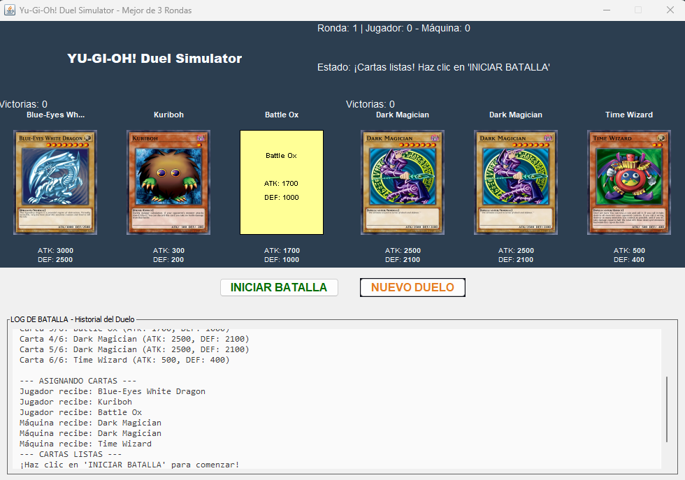
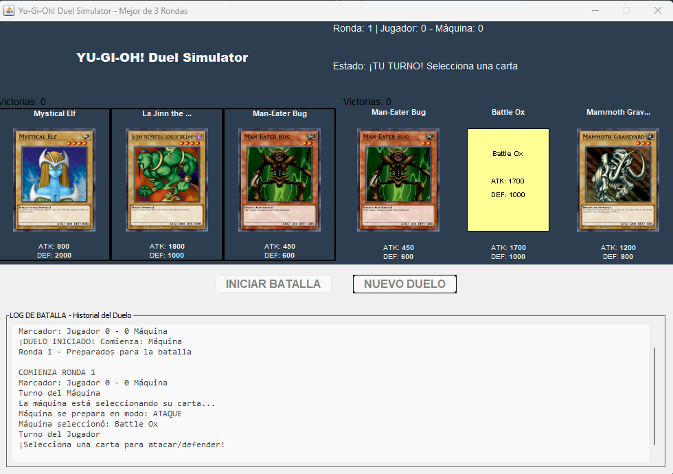
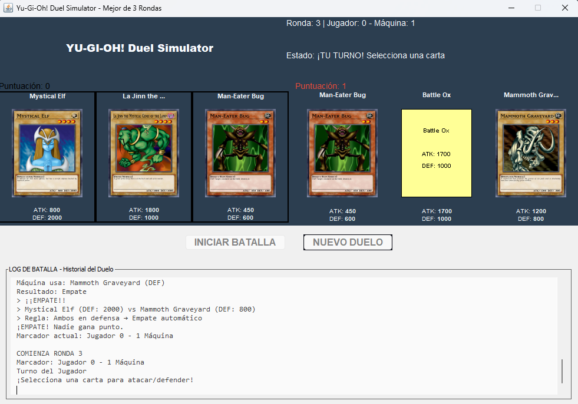
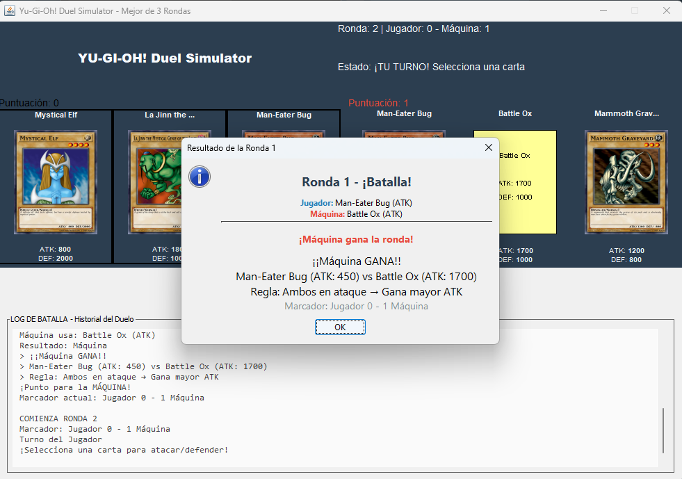
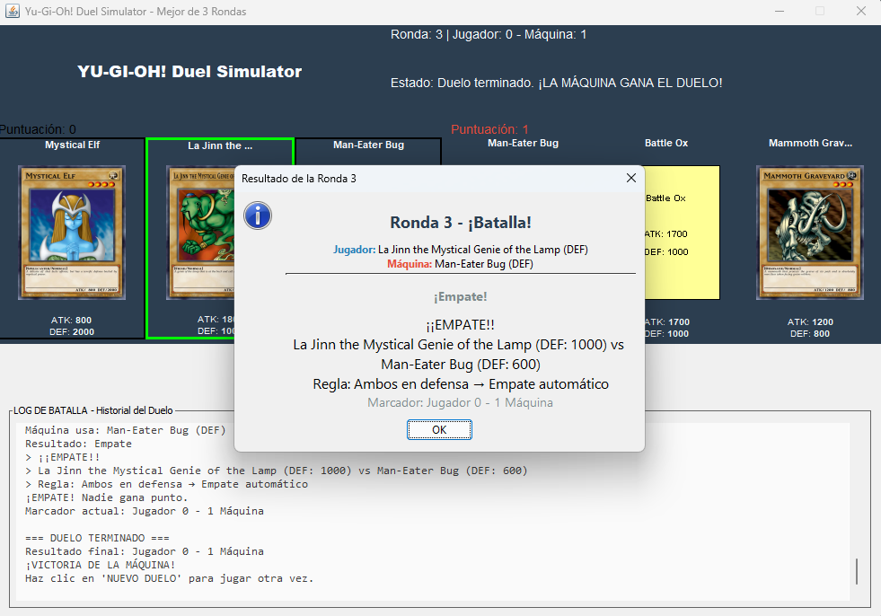
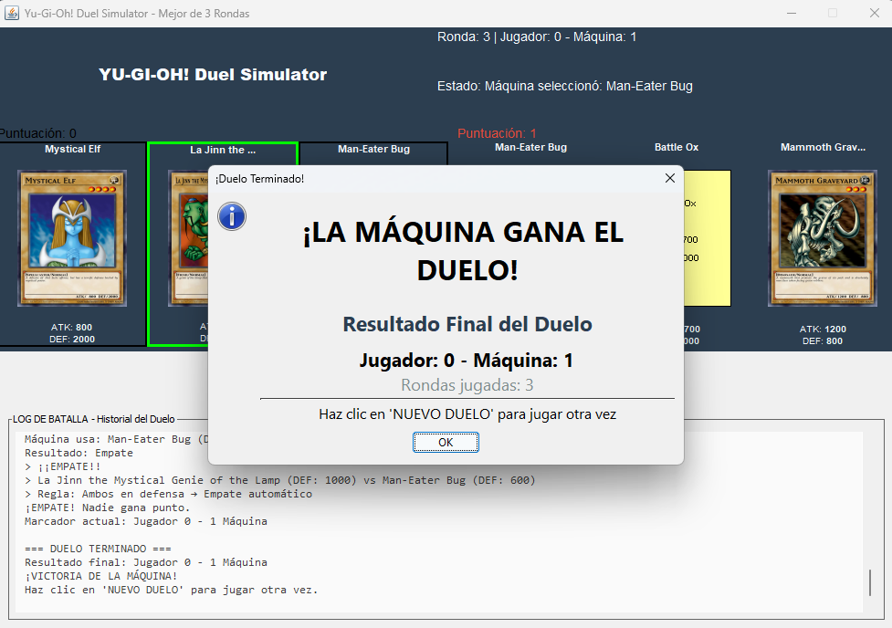
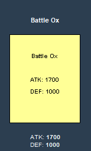

# Yu-Gi-Oh! Duel Simulator

Un simualdor de duelos de Yu-Gi-Oh! que permite enfrentarse contra la Máquina usando
cartas reales obtenidas de la API oficial de YGOProDeck. Implementa las reglas oficiales
del juego con una interfaz.

## Características

- **Cartas reales** obtenidas desde YGOProDeck API
- **Reglas oficiales** de Yu-Gi-Oh! (modos ataque/defensa)
- **Interfaz gráfica** desarrollada con Java Swing
- **Sistema de Máquina** con turnos alternados
- **Log de batallas** detallado con estadísticas completas
- **Sistema de rondas** (mejor de 3)
- **Reinicio completo** de duelos
- **Manejo de errores** y modo offline con cartas predefinidas
- **Interfaz responsive** con carga asíncrona de imágenes

## Instrucciones de ejecución

### Prerrequisitos

- **Java 11+**
- **Conexión a Internet** (para cargar cartas desde la API)
- **IntelliJ IDEA** 
- **Swing** para interfaz

### Configuración de Dependencias

1. **Descarga la dependencia JSON:**
   - Obtén 'json-20250517.jar' desde [Maven Repository](https://mvnrepository.com/artifact/org.json/json/20250517)
   - Colócalo en la carpeta 'lib/' del proyecto

2. **Configuración en IntelliJ IDEA:**
   - Abre 'File -> Project Structure -> Libraries'
   - Haz clic en '+' -> 'Java'
   - Selecciona el archivo 'json-20250517.jar' de la carpeta 'lib/'
   - Aplica los cambios

### Ejecución del Proyecto

1. **Abre el archivo 'Main.java'**
2. **Haz clic en el boton ▶️ Run** verde
3. **O alternativamente:** clic derecho -> 'Run 'Main.main()''

### Cómo Jugar

1. **Esperar** a que se carguen automáticamente las 6 cartas desde la API
2. **Haz clic** en el botón 'INICIAR BATALLA' para comenzar el duelo
3. **En tu turno**, selecciona una carta haciendo clic sobre ella
4. **Observa** el resultado de cada batalla en el log detallado
5. **Gana 2 de 3 rondas** oara ganar el duelo
6. **Usa el botón "NUEVO DUELO"** para reiniciar con nuevas cartas

## Diseño del Sistema

El simulador sigue una **arquitectura MVC (Modelo-Vista-Controlador)** con separación clara de responsabilidades. El **Modelo** (`card`) representa las cartas con sus atributos y validaciones, la **Vista** (`DuelFrame`) maneja la interfaz gráfica usando Java Swing, y el **Controlador** (`Duel`) gestiona la lógica del juego, turnos y resolución de batallas según las reglas oficiales de Yu-Gi-Oh!.

Se implementa el **patrón Observer** mediante `BattleListener` para desacoplar la lógica del juego de la interfaz, permitiendo comunicación asíncrona entre componentes. El `YgoApiClient` se encarga de obtener cartas reales desde la API YGOProDeck con sistema de fallback para operación offline, mientras que el manejo de hilos con `ExecutorService` garantiza que la interfaz permanezca responsive durante las operaciones de red mediante la ejecución concurrente de:
- Carga de múltiples cartas desde la API
- Descarga asíncrona de imágenes
- Procesamiento no bloqueante de peticiones HTTP

### Flujo de Datos
1. **Inicialización**: YgoApiClient obtiene cartas → Modelo Card las almacena
2. **Interacción**: Usuario selecciona carta → Vista notifica al Controlador
3. **Procesamiento**: Duel resuelve batalla → Notifica via BattleListener
4. **Actualización**: Vista refleja resultados manteniendo UI responsive

## Capturas de Pantalla

### Pantalla Principal - Conectando API

*Interfaz principal conectando API para cargar datos y la imagen de las Cartas*

### Pantalla Principal - Cartas Cargadas

*Interfaz principal mostrando las 6 cartas cargadas (3 para jugador, 3 para máquina) con botones de control habilitados*

### Duelo en Progreso - Turno del Jugador

*Turno del jugador para la ronda 1 con cartas interactivas, log de batalla mostrando historial y marcador actual*

*Turno del jugador para la ronda 2*

*Turno del jugador para la ronda 3*

### Resultado de Batalla - Resultados de las rondas

*Diálogo modal mostrando el resultado detallado de la ronda 1 con estadisticas y reglas aplicadas*

*Diálogo modal mostrando el resultado detallado de la ronda 2 con estadisticas y reglas aplicadas*

*Diálogo modal mostrando el resultado detallado de la ronda 3 con estadisticas y reglas aplicadas*

### Resultado final - Duelo Terminado

*Diálogo modal mostrando el ganador del duelo, marcador final y opción para nuevo duelo*

### No carga de carta - Problema de carga

*Cuando las cartas no cargas*

